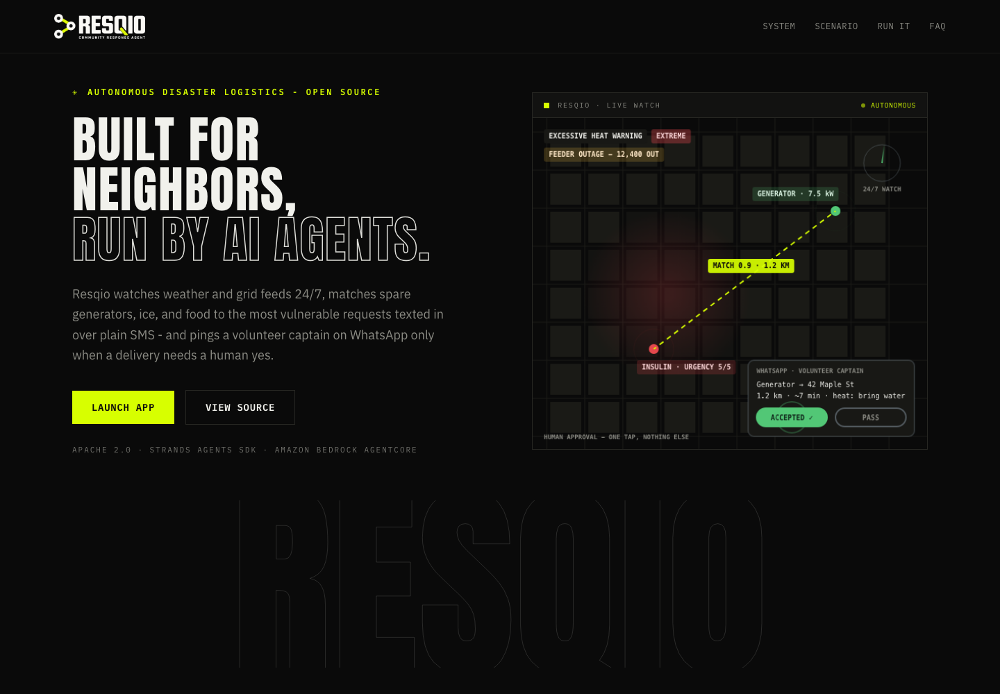
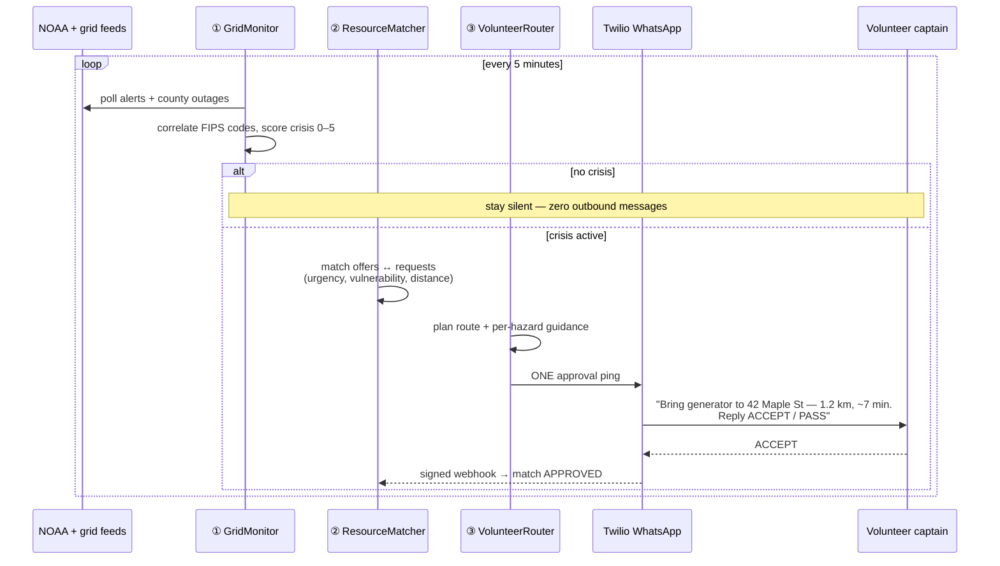
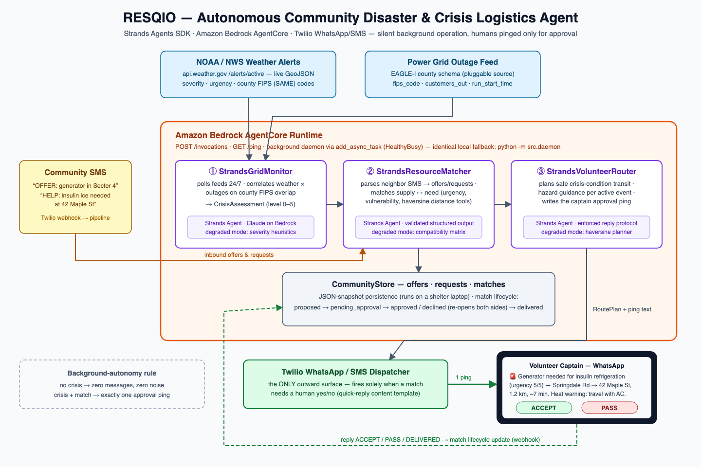
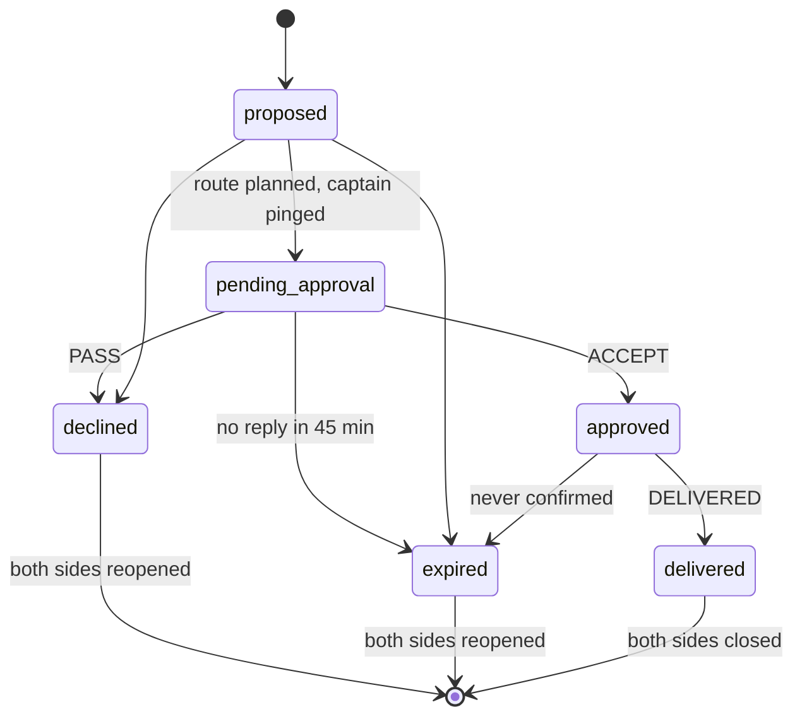
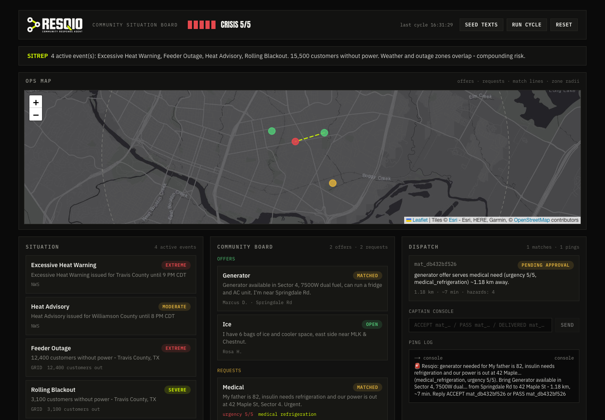

<div align="center">

# 🚨 Resqio

### When the power fails, neighbors are the fastest responders.

**An autonomous community disaster-logistics agent.** It watches weather and grid feeds 24/7, matches neighbors' spare generators, ice, and food to the most vulnerable requests texted in over plain SMS — and pings a volunteer captain on WhatsApp **only** when a delivery needs a one-tap human yes.

[](https://www.python.org/)
[](https://strandsagents.com)
[](https://aws.amazon.com/bedrock/agentcore/)
[](https://github.com/mrnetwork0001/Resqio/actions/workflows/tests.yml)
[](LICENSE)

**3 Strands agents · AgentCore HealthyBusy background daemon · full loop runs offline with zero credentials**

Built for the **AWS Agents for Humans Hackathon** · Good Neighbor Agents track

### ▶ [Live demo](https://tryresqio.vercel.app) · [Open the situation board](https://tryresqio.vercel.app/board)



</div>

---

## Table of contents

- [The 60-second pitch](#-the-60-second-pitch)
- [Run the demo in 3 commands](#-run-the-demo-in-3-commands)
- [How it works](#-how-it-works)
- [Architecture](#-architecture)
- [Built on Strands Agents SDK](#-built-on-strands-agents-sdk)
- [Built for Amazon Bedrock AgentCore](#-built-for-amazon-bedrock-agentcore)
- [Designed for the worst day](#-designed-for-the-worst-day)
- [Correctness & safety](#-correctness--safety)
- [The web client](#-the-web-client)
- [Live mode configuration](#-live-mode-configuration)
- [Data sources, honestly](#-data-sources-honestly)
- [Testing](#-testing)
- [Hackathon alignment](#-hackathon-alignment)
- [Repository structure](#-repository-structure)
- [Roadmap](#-roadmap)

---

## ⚡ The 60-second pitch

During a heatwave-driven blackout, an 82-year-old's insulin starts spoiling at 42 Maple St. A few blocks away, a neighbor has a 7.5 kW generator sitting in the garage. **The help exists — the coordination doesn't.** Heat is the [deadliest weather hazard in the United States](https://www.weather.gov/hazstat/), it's exactly what knocks the grid over, and when it does, emergency services are overwhelmed within hours — nobody in a crisis has bandwidth to run a spreadsheet.

Resqio closes that gap by turning crisis coordination into a **silent background process, run by AI agents, checked by humans**:

1. **It watches** — NOAA/NWS alerts and county-level outage data, polled around the clock, correlated on county FIPS codes. Extreme heat *plus* a 12,400-customer feeder outage is read as the compounding emergency it is.
2. **It listens** — neighbors text plain SMS: *"OFFER: generator available in Sector 4"* · *"HELP: insulin needs refrigeration at 42 Maple St. Urgent."* No app, no account, nothing to learn mid-crisis.
3. **It matches** — supply to need, on urgency, vulnerability, and distance. Medical refrigeration, infants, and elderly residents outrank everything.
4. **It asks a human** — one WhatsApp ping to a volunteer captain with the route and hazards. **Accept** dispatches the delivery. **Pass** puts both sides back on the board. That tap is the *only* time a person hears from Resqio.

No crisis → zero messages. **The agent's silence is a feature.**

## 🏃 Run the demo in 3 commands

No AWS account, no Twilio, no API keys — the full loop runs offline (see [why](#-designed-for-the-worst-day)). Prerequisites: **Python 3.11+** (that's all; Node 18.17+ only if you also want the [web client](#-the-web-client)).

```bash
git clone https://github.com/mrnetwork0001/Resqio.git && cd Resqio
python3 -m venv .venv && source .venv/bin/activate && pip install -r requirements.txt   # any Python 3.11+
python -m src.demo
```

You'll watch the **Austin heatwave scenario** end to end — abridged below (`…` marks cuts; the ping prints as one line in your terminal):

```text
======================================================================
  RESQIO — Autonomous Community Disaster & Crisis Logistics Agent
  Scenario: Austin heatwave + Sector 4 feeder outage
  ℹ Without AWS credentials the agents run their deterministic
    degraded mode — by design; with credentials, live Bedrock reasoning.
======================================================================
…
📱  VOLUNTEER CAPTAIN PING  (demo console)
──────────────────────────────────────────────────────────────
🚨 Resqio: generator needed for My father is 82, insulin needs
refrigeration and our power is out at 42 Maple… (medical_refrigeration,
urgency 5/5). Bring Generator available in Sector 4, 7500W dual… from
Springdale Rd to 42 Maple St — 1.18 km, ~7 min.
Reply ACCEPT mat_008c4e5ed7 or PASS mat_008c4e5ed7
══════════════════════════════════════════════════════════════
…
  Crisis: True   Level: 5/5
  Matches proposed: 1   Captain pings sent: 1

✅ Full loop: silent monitoring → autonomous matching → one-tap human approval → delivery.
```

Then drive it yourself from the browser — see [The web client](#-the-web-client).

## 🔁 How it works

One background cycle, every `POLL_INTERVAL_SECONDS` (default 5 minutes):



Inbound SMS/WhatsApp flows in at any time through a **signature-validated webhook** — new offers and requests land on the community board in seconds, and captain replies (`ACCEPT` / `PASS` / `DELIVERED`) drive the match lifecycle.

## 🏗 Architecture



| Agent | File | Responsibility |
| :--- | :--- | :--- |
| **① StrandsGridMonitor** | [`src/agents/strands_grid_monitor.py`](src/agents/strands_grid_monitor.py) | Polls NOAA `api.weather.gov` + EAGLE-I-schema outage records; correlates hazards on shared county FIPS codes; returns a validated `CrisisAssessment` (level 0–5). |
| **② StrandsResourceMatcher** | [`src/agents/strands_resource_matcher.py`](src/agents/strands_resource_matcher.py) | Parses informal SMS into structured offers/requests; proposes matches with spatial-reasoning `@tool`s; **every LLM proposal is re-validated against the live board** before it's recorded. |
| **③ StrandsVolunteerRouter** | [`src/agents/strands_volunteer_router.py`](src/agents/strands_volunteer_router.py) | Plans crisis-condition transit with per-hazard guidance (dark intersections, heat exposure, flooded roads) and writes the approval ping, always ending `Reply ACCEPT <id> or PASS <id>`. |

Around the agents: a single **orchestrator** ([`src/orchestrator.py`](src/orchestrator.py)) runs the monitor → match → route → ping cycle; the **CommunityStore** ([`src/core/store.py`](src/core/store.py)) is a JSON-snapshot board that runs on a shelter laptop — fsync'd writes, corrupt-file quarantine, no database cluster required; the **Twilio dispatcher** ([`src/integrations/twilio_whatsapp_dispatcher.py`](src/integrations/twilio_whatsapp_dispatcher.py)) is the pipeline's only outward surface.

**Multi-county zones** ([`src/core/zones.py`](src/core/zones.py)): a deployment can define service zones — each with its own NOAA area, county FIPS codes, centroid + radius, and **volunteer captain roster** ([`data/zones.json`](data/zones.json)). Inbound offers and requests are assigned to a zone by location, matching stays within a zone (volunteers serve their own neighborhood), and approval pings go to that zone's captains. No zones file → the original single-zone behavior, unchanged.

## 🧠 Built on Strands Agents SDK

The agents are genuine [Strands](https://strandsagents.com) agents, not decoration:

- **`Agent` + custom `@tool`s** — each agent carries purpose-built tools (`fetch_weather_alerts`, `list_open_requests`, `compute_distance_km`, `compute_trip_distance`) whose schemas come from type hints and docstrings.
- **Structured output on the current API** — every reasoning step returns a validated Pydantic model via `agent(prompt, structured_output_model=CrisisAssessment)` → `result.structured_output`. LLM output that doesn't validate never enters the pipeline.
- **`BedrockModel`** with per-agent temperatures (0.0 for SMS parsing, 0.2 for triage/matching, 0.3 for routing), targeting Claude via Bedrock inference profiles.
- **Trust boundaries** — the daemon polls deterministically (a scheduler's job); the agents *reason* over the snapshot. Matcher proposals are re-checked against the store under a lock before anything is booked.

## ☁️ Built for Amazon Bedrock AgentCore

[`src/aws/bedrock_agentcore_handler.py`](src/aws/bedrock_agentcore_handler.py) wraps the pipeline in a `BedrockAgentCoreApp` (`POST /invocations`, `GET /ping`). The `daemon` action runs the polling loop on a background thread tracked with `add_async_task`, so the session reports **HealthyBusy** and the runtime keeps it alive between cycles — the entrypoint thread never blocks the health check. The runtime contract is verified end-to-end locally (`/ping` → Healthy, all four actions); the cloud deployment run is a [roadmap](#-roadmap) item.

```bash
# Local runtime check (serves :8080; RESQIO_AGENTCORE_PORT overrides)
python -m src.aws.bedrock_agentcore_handler
curl -X POST localhost:8080/invocations -H 'Content-Type: application/json' -d '{"action": "cycle"}'
```

Payload actions: `cycle` · `daemon` · `inbound_sms` · `status`.

```bash
# Deploy with the AgentCore CLI (npm — supersedes the pip starter-toolkit CLI)
npm install -g @aws/agentcore
agentcore create --name Resqio --framework Strands --protocol HTTP --model-provider Bedrock
# `create` scaffolds a wrapper project — point its runtime entrypoint at
# src/aws/bedrock_agentcore_handler.py (copy src/ + requirements.txt into the
# generated app dir), then:
agentcore deploy
agentcore invoke --runtime Resqio '{"action": "daemon", "cycles": 12}'
```

Alternative: build a `linux/arm64` image serving this app on `:8080`, push to ECR, and register it via boto3 `bedrock-agentcore-control.create_agent_runtime`.

## 🛡 Designed for the worst day

**A disaster tool can't assume the cloud is healthy mid-disaster.** Every LLM reasoning step has a deterministic degraded-mode fallback:

| Step | Live reasoning (Bedrock) | Degraded fallback (pure logic) |
| :--- | :--- | :--- |
| Crisis assessment | Claude correlates hazards, scores 0–5 | Severity thresholds + FIPS-overlap escalation |
| SMS parsing | Claude reads informal text | Keyword parser (word-boundary matching, urgency/vulnerability heuristics) |
| Matching | Claude + distance tools | Compatibility matrix + haversine, greedy by urgency |
| Routing | Claude writes hazard-aware plans | Deterministic planner + per-hazard guidance templates |

If Bedrock is unreachable, the pipeline **keeps flowing** — slower thinking, same protocol. This one property is also why the entire demo and test suite run with **zero credentials**, and why judges can clone-and-run in under a minute.

Same philosophy everywhere: a feed failure means *"no change"*, never *"all clear"*; the 24/7 loop survives any single bad cycle; a Twilio send failure falls back per-captain instead of stranding a match.

## 🔒 Correctness & safety

The match lifecycle is a **guarded state machine** — because during a real disaster, multiple captains reply to the same ping, and webhooks get retried:



- A second captain's stale `PASS` **cannot** reopen a delivery someone already accepted (they get *"already approved — no change made"*).
- `record_match` re-verifies both sides are still open **under the store lock** — no double-booking across concurrent cycles.
- Unanswered pings **expire after 45 minutes** (`RESQIO_MATCH_TTL_MINUTES`) and free both sides for re-matching.
- Inbound webhooks validate `X-Twilio-Signature` whenever a Twilio auth token is configured (live mode), so a random POST can't inject offers or approve matches.
- The store fsyncs before atomic replace; a corrupt `store.json` is quarantined instead of bricking startup.

This hardening isn't theoretical: the codebase went through a multi-lens **adversarial review** (correctness, API misuse, resilience, spec compliance — each finding independently verified), and all 20 confirmed findings were fixed in one auditable [hardening commit](https://github.com/mrnetwork0001/Resqio/commit/ca3f607) — including a reproduced PASS-after-ACCEPT double-booking, closed with regression tests, and a two-process store split-brain, closed architecturally (single-process runtime, single-writer store).

## 🖥 The web client

Requires **Node.js 18.17+** (Next.js 14).

```bash
# Terminal 1 — the Resqio runtime (webhook + dashboard API + poll loop)
python -m src.integrations.webhook_server            # :5001

# Terminal 2 — the web client
cd client && npm install && npm run dev              # :3000
```

<div align="center">

</div>

- **`/` — landing page**: what Resqio is and why, with an always-on canvas animation of the full loop.
- **`/board` — situation board**: live crisis gauge + SITREP, an **ops map** (offers, requests, match lines, and zone radii on a dark basemap), active NWS/grid events with severity, the community offer/request board with urgency and vulnerability tags, match dispatch with route estimates, the ping log, and a captain console (`ACCEPT` / `PASS` / `DELIVERED`). **Seed texts → Run cycle → Reset** buttons drive the whole scenario from the browser.

The board is read-only observability plus demo controls — the agent itself stays a silent background process, exactly as the track brief asks.

## ⚙️ Live mode configuration

Copy `.env.example` → `.env` and fill in what you have. Everything defaults demo-safe, and the complete variable list lives in [`.env.example`](.env.example).

<details>
<summary><b>Environment variables & Twilio setup</b> (click to expand)</summary>

| Variable | Default | Purpose |
| :--- | :--- | :--- |
| `AWS_REGION` | `us-east-1` | Bedrock region |
| `BEDROCK_MODEL_ID` | `global.anthropic.claude-sonnet-4-6` | Any tool-use-capable model (use inference-profile ids) |
| `NOAA_AREA` | `TX` | State code for `api.weather.gov` alert polling |
| `NOAA_USER_AGENT` | *(placeholder)* | NWS requires a `(app, contact-email)` User-Agent |
| `POLL_INTERVAL_SECONDS` | `300` | Background cycle cadence |
| `TWILIO_ACCOUNT_SID` / `TWILIO_AUTH_TOKEN` | — | Twilio credentials |
| `TWILIO_WHATSAPP_FROM` / `TWILIO_SMS_FROM` | sandbox / — | WhatsApp and SMS senders |
| `TWILIO_CONTENT_SID` | — | Approved quick-reply template for business-initiated pings |
| `RESQIO_CAPTAIN_NUMBERS` | — | Comma-separated captain numbers (`whatsapp:+1…`) |
| `RESQIO_DEMO_MODE` | `1` | `1` = simulated feeds + console pings; `0` = live |
| `RESQIO_MATCH_TTL_MINUTES` | `45` | Unanswered-ping expiry |
| `RESQIO_WEBHOOK_URL` / `RESQIO_WEBHOOK_PORT` | request URL / `5001` | Public URL Twilio signs against · server port |

**Twilio dev setup**: captains join the WhatsApp Sandbox (text `join <code>` to `+1 415 523 8886`), which opens the 24-hour session window for free-form pings. For production business-initiated pings, set `TWILIO_CONTENT_SID` to an approved `twilio/quick-reply` template and captains get real **[Accept] [Pass]** buttons; taps arrive as `ButtonPayload` on the webhook.

The live local runtime is a **single process** — the webhook server ingests inbound SMS *and* runs the poll loop on an embedded thread (the JSON store is single-writer by design; don't run `src.daemon` against the same store file simultaneously). Expose it with `ngrok http 5001` and point the Twilio "When a message comes in" URL at `POST /sms`; behind a proxy, set `RESQIO_WEBHOOK_URL` to the exact public URL Twilio signs against.

</details>

## 📡 Data sources, honestly

- **Weather**: live from NOAA/NWS `api.weather.gov` — free, no key, correct `User-Agent` required. Alerts are deduplicated by id, `Cancel` messages honored, `ends` preferred over `expires`. **Validated against production**: the live path parses real multi-county alert sets (including active Extreme Heat Warnings) with FIPS codes and timezone-aware expiries intact, and multi-state queries work as one comma-joined request.
- **Power outages**: there is **no free real-time national outage feed** — EAGLE-I is restricted to government/utility accounts, and poweroutage.us is a paid enterprise API. So the grid source is a pluggable two-method protocol: `SimulatedGridFeed` ships realistic **EAGLE-I-schema** county records (`fips_code`, `county`, `state`, `customers_out`, `run_start_time`) for the demo, and any utility API can implement the same protocol without touching the agents.

## ✅ Testing

```bash
python -m pytest        # 82 tests, ~2 s, fully offline
```

The suite covers the NWS alert parser (dedupe, cancels, `ends` fallback), the grid severity ladder, the store's state machine and persistence (including corrupt-file quarantine), heuristic parsing and matching, route planning, match-TTL expiry, stale-reply guards, zone assignment and zone-scoped matching, and the full pipeline cycle — all on the degraded-mode paths, so CI needs no cloud. With AWS credentials configured, the same commands switch to live Claude reasoning on Bedrock (the live validation run is a [roadmap](#-roadmap) item).

## 🏆 Hackathon alignment

| Criterion | Where Resqio delivers |
| :--- | :--- |
| **Strands Agents SDK** | Three specialized agents with custom `@tool`s and validated structured output — see [Built on Strands](#-built-on-strands-agents-sdk) |
| **Amazon Bedrock AgentCore** | Runtime entrypoint with HealthyBusy background daemon, verified locally against the runtime contract — see [AgentCore](#-built-for-amazon-bedrock-agentcore) |
| **Background autonomy** | Runs silently 24/7; the *only* outbound message is a human-approval ping |
| **Real work, end to end** | Feed polling → SMS intake → matching → routing → dispatch → delivery confirmation |
| **Good Neighbor track** | Built for neighborhoods, food banks, shelters, and mutual-aid networks |
| **Resilience** | Degraded-mode fallbacks, guarded state machine, 20 adversarial-review findings fixed in an auditable [commit](https://github.com/mrnetwork0001/Resqio/commit/ca3f607) |

## 📁 Repository structure

```
Resqio/
├── LICENSE                      # Apache 2.0
├── architecture_diagram.png     # (source: docs/architecture_diagram.svg)
├── RESQIO_PROJECT_SPEC.md       # master blueprint
├── src/
│   ├── agents/                  # the three Strands agents
│   ├── aws/                     # Bedrock AgentCore entrypoint
│   ├── core/                    # models, feeds, store, geo, config
│   ├── integrations/            # Twilio dispatcher + webhook/API server
│   ├── orchestrator.py          # monitor → match → route → ping pipeline
│   ├── daemon.py                # standalone 24/7 polling loop
│   └── demo.py                  # end-to-end Austin heatwave scenario
├── client/                      # Next.js 14 landing page + situation board
├── data/demo/                   # NWS + EAGLE-I-schema fixtures, seeded SMS
├── docs/                        # diagram source, screenshots
└── tests/                       # offline test suite (no cloud, no keys)
```

## 🗺 Roadmap

- 5-minute demo video with human voiceover — the link will land right under the badges
- Live Bedrock + Twilio sandbox validation run (agent reasoning is verified in degraded mode by design; the NOAA live path is already validated against production)
- AgentCore cloud deployment recorded for the demo video
- Public VPS deployment (live board + real Twilio webhook, 24/7 daemon under systemd)

Shipped from this roadmap already: ✅ ops map on the situation board · ✅ multi-county zones with per-zone captain rosters · ✅ live NOAA validation

## 📄 License

[Apache 2.0](LICENSE) — built by **Ifeanyichukwu Onwo** ([@mrnetwork0001](https://github.com/mrnetwork0001)) for the AWS Agents for Humans Hackathon.

> *The next storm isn't waiting. Fork it for your county.*
